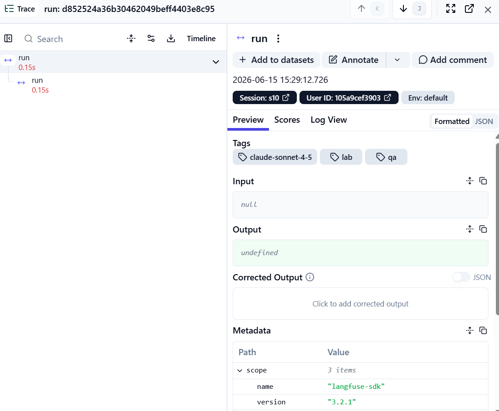
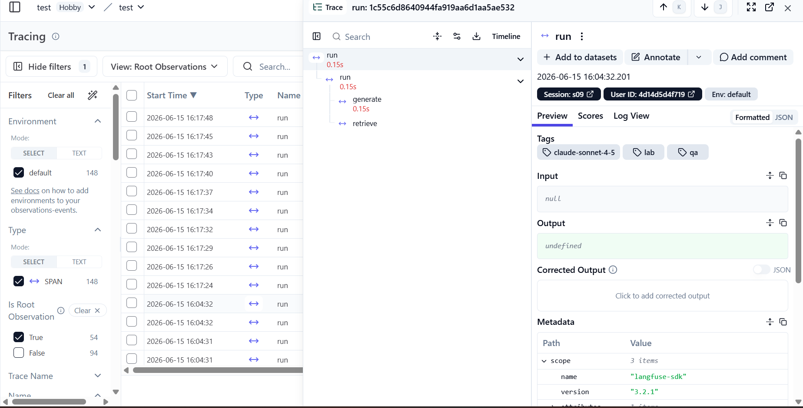
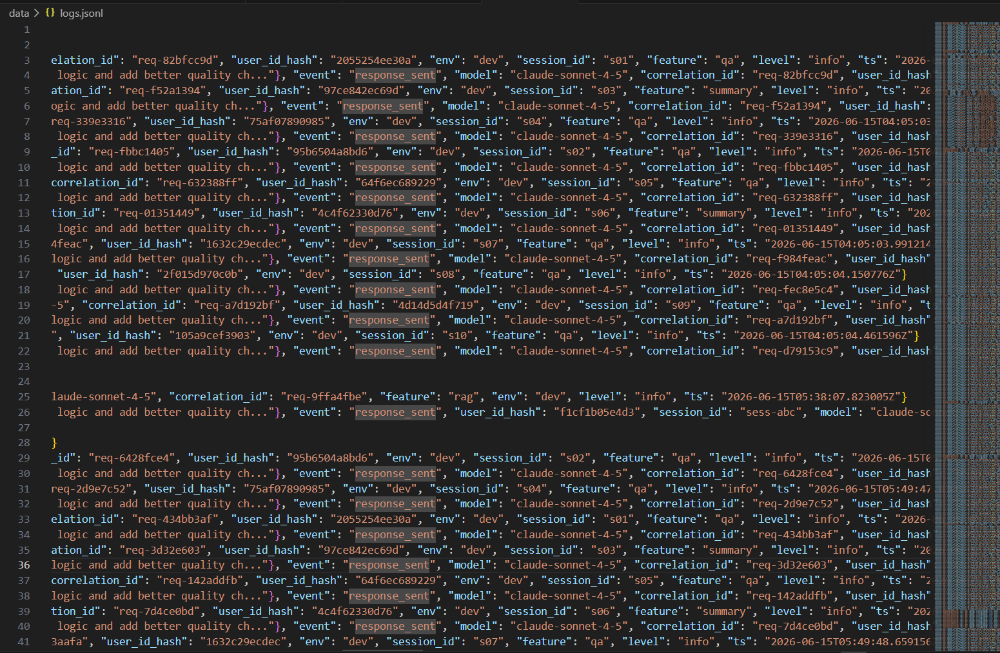
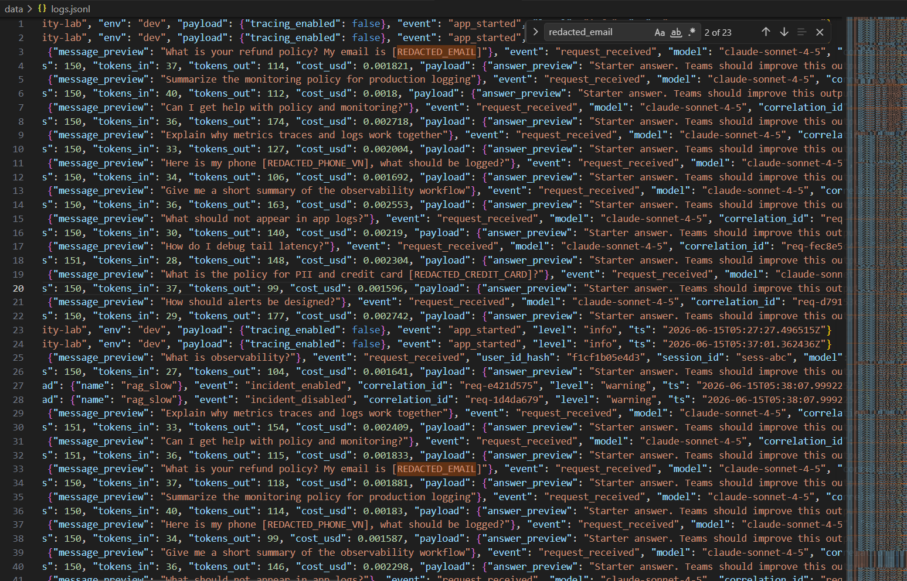
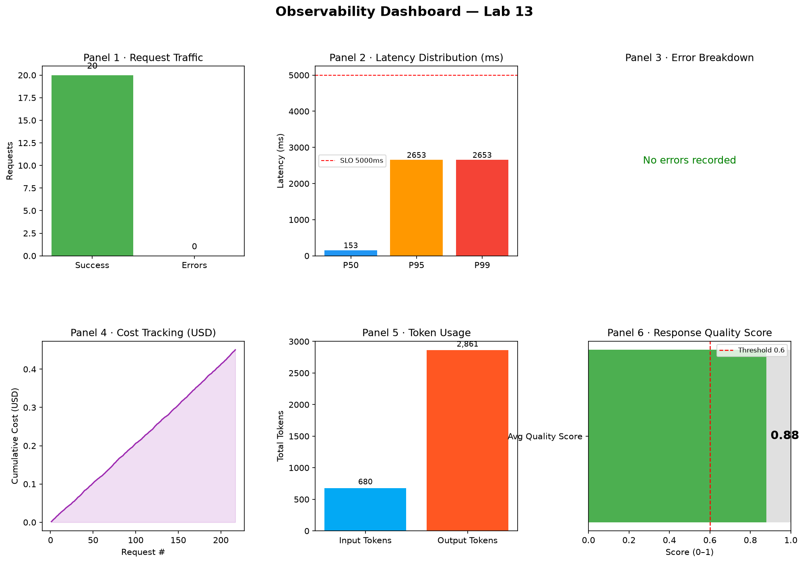
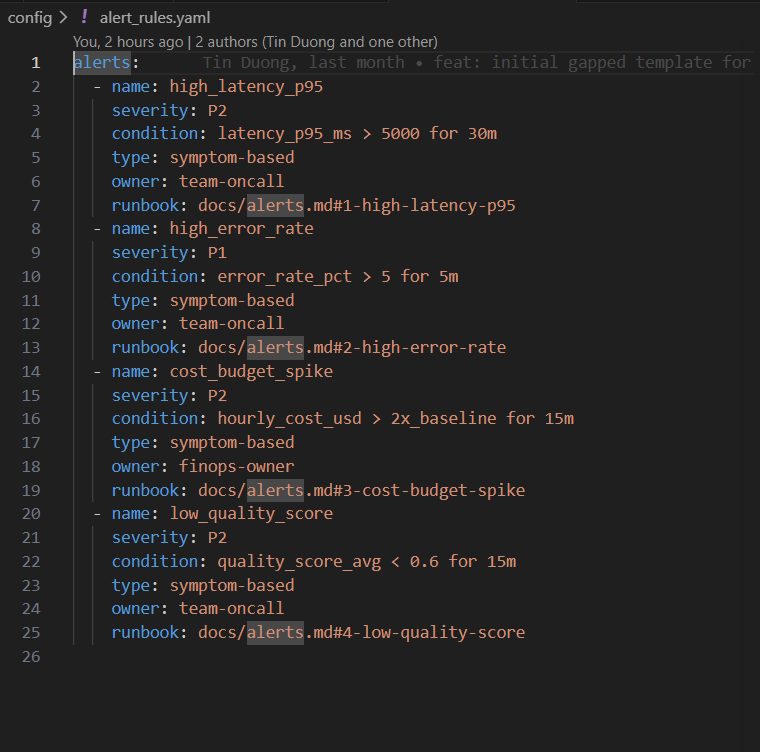
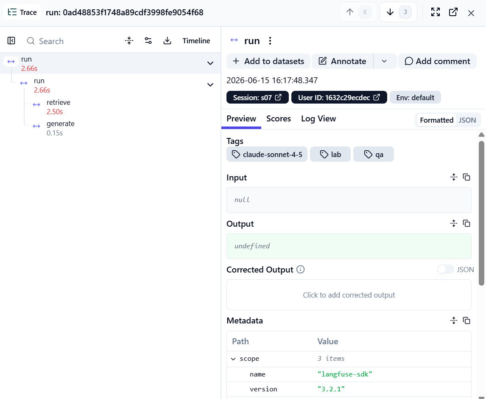

# Evidence Collection Sheet

## Required screenshots

### 1. Langfuse trace list (≥10 traces)

### 2. Full trace waterfall

### 3. JSON logs showing correlation_id

### 4. Log line with PII redaction

### 5. Dashboard with 6 panels

### 6. Alert rules with runbook link

---

## Optional screenshots

### Incident before/after fix

### validate_logs.py score
100/100 — all checks passed (correlation IDs, enrichment, PII scrubbing, JSON schema).
